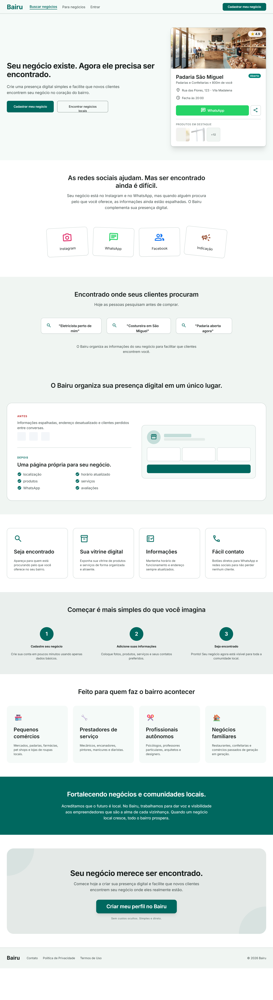

# DS-003 — Homepage High Fidelity

---

# Objetivo

Este documento apresenta a primeira versão visual (High Fidelity) da homepage institucional do Bairu.

Seu objetivo é servir como referência oficial para a implementação da interface da aplicação, garantindo consistência visual, alinhamento com o Product Requirements Document (PRD-001) e aderência aos princípios estabelecidos pelo Design System.

O layout documentado aqui representa a materialização da estratégia de comunicação do produto definida durante a fase de descoberta.

---

# Contexto

O Bairu nasce para resolver um problema específico:

Pequenos negócios locais existem, mas dificilmente são encontrados por novos clientes.

A homepage institucional foi concebida para comunicar esse problema de forma clara e demonstrar como a plataforma resolve essa dificuldade.

Diferentemente de uma landing page voltada exclusivamente para marketing, a homepage também estabelece a identidade do produto e servirá como porta de entrada oficial da plataforma durante o MVP.

---

# Objetivos da Homepage

A homepage possui quatro objetivos principais:

- comunicar rapidamente a proposta de valor do Bairu;
- convencer proprietários de negócios locais a criarem seu perfil na plataforma;
- demonstrar visualmente como um perfil comercial será apresentado aos visitantes;
- servir como referência para futuras páginas institucionais da plataforma.

---

# Público-alvo

O foco principal desta primeira versão é composto por proprietários de pequenos negócios locais, incluindo:

- pequenos comércios;
- profissionais autônomos;
- prestadores de serviços;
- empreendedores que possuem baixa ou nenhuma presença digital.

Embora consumidores também possam acessar a homepage, toda a narrativa foi construída priorizando a aquisição inicial de empresas cadastradas, conforme definido no ADR-003 — Estratégia de Adoção Inicial do Bairu.

---

# Estratégia de Comunicação

A homepage utiliza uma estrutura narrativa baseada em transformação.

Ao invés de apresentar funcionalidades logo no início, a comunicação segue uma sequência lógica:

1. apresentar o problema;
2. gerar identificação com a dor;
3. demonstrar a solução;
4. explicar como funciona;
5. reduzir barreiras;
6. incentivar a criação do perfil.

Essa abordagem foi escolhida para aumentar a conversão de visitantes em empresas cadastradas durante o MVP.

---

# Estrutura da Página

A homepage é composta pelos seguintes blocos:

## 1. Header

Responsável pela navegação principal da plataforma.

Contém:

- logotipo;
- navegação principal;
- CTA de cadastro.

## 2. Hero

Primeiro contato do usuário com o produto.

Objetivos:

- comunicar a proposta de valor;
- apresentar o principal CTA;
- exibir uma prévia realista de um perfil empresarial.

## 3. Problema

Expõe a dificuldade enfrentada pelos pequenos negócios:

- presença digital fragmentada;
- dependência de redes sociais;
- baixa visibilidade em mecanismos de busca.

Esta seção cria identificação antes da apresentação da solução.

## 4. Solução

Apresenta como o Bairu organiza todas as informações do negócio em um único perfil profissional.

Esta seção faz a transição entre problema e benefício.

## 5. Benefícios

Lista os principais ganhos para o empreendedor.

Exemplos:

- ser encontrado;
- divulgar produtos;
- manter informações atualizadas;
- facilitar o contato com clientes.

## 6. Como funciona

Explica o processo de cadastro em três etapas simples:

- criar o perfil;
- adicionar informações;
- começar a ser encontrado.

Esta seção reduz a percepção de complexidade.

## 7. Público-alvo

Mostra exemplos de negócios que podem utilizar a plataforma.

Seu objetivo é aumentar a identificação do visitante.

## 8. Missão

Apresenta o propósito do Bairu.

Mais do que uma plataforma tecnológica, o Bairu busca fortalecer comunidades locais por meio da valorização dos pequenos negócios.

## 9. CTA Final

Reforça a proposta de valor e incentiva a criação do perfil empresarial.

Este é o principal ponto de conversão da homepage.

## 10. Footer

Contém:

- identidade da plataforma;
- links institucionais;
- informações legais.
- Componentes do Design System

A homepage utiliza componentes reutilizáveis que servirão de base para toda a plataforma.

Entre eles:

- Header
- Footer
- Hero
- Section Title
- CTA
- Benefit Card
- Company Card
- Step Card
- Badge
- Button
- Product Preview Card

Sempre que possível, novos layouts deverão reutilizar esses componentes em vez de criar novas implementações.

---

# Diretrizes Visuais

Esta versão segue integralmente os tokens definidos em:

DS-001 — Fundamentos do Design System
DS-002 — Tokens Fundamentais

Foram utilizados:

- paleta institucional;
- tipografia oficial;
- sistema de espaçamentos;
- bordas;
- raios;
- componentes base do Design System.

---

# Responsividade

O layout foi concebido seguindo a estratégia Mobile First.

As adaptações incluem:

- reorganização de grids;
- empilhamento de seções;
- redimensionamento tipográfico;
- adaptação dos CTAs;
- ajuste de espaçamentos.

---

# Referência Visual

A imagem abaixo representa a versão oficial da homepage institucional durante a Sprint 2.

Relação com outros documentos

Este documento complementa:

ADR-003 — Estratégia de Adoção Inicial do Bairu
PRD-001 — Homepage Institucional
DS-001 — Fundamentos do Design System
DS-002 — Tokens Fundamentais

Enquanto o PRD descreve os objetivos do produto, este documento registra sua representação visual oficial.

---

# Evolução

Esta homepage representa a primeira versão da identidade visual do Bairu.

Durante a evolução da plataforma poderão ser adicionadas novas seções, componentes e interações, preservando os princípios estabelecidos pelo Design System e mantendo consistência visual em toda a experiência do usuário.
